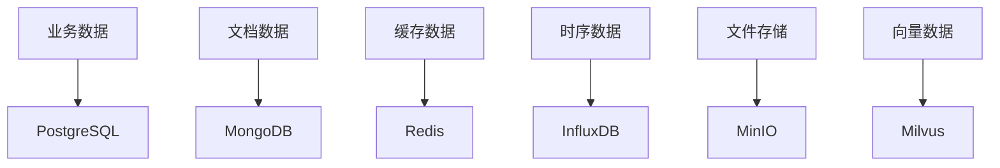
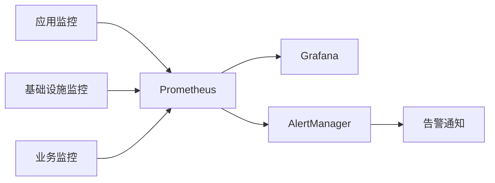

# 失效分析智能辅助平台 - 技术架构设计

## 1. 系统总体架构

### 1.1 架构层次
```
┌─────────────────────────────────────────────────────────────┐
│                    前端展示层 (Frontend)                      │
│  React 18 + TypeScript + Ant Design + ECharts               │
└─────────────────────────────────────────────────────────────┘
                              │
┌─────────────────────────────────────────────────────────────┐
│                    API网关层 (API Gateway)                   │
│  Spring Cloud Gateway + 统一认证 + 限流熔断                   │
└─────────────────────────────────────────────────────────────┘
                              │
┌─────────────────────────────────────────────────────────────┐
│                   微服务层 (Microservices)                   │
│  ┌─────────────┐ ┌─────────────┐ ┌─────────────────────────┐ │
│  │ 多模态工作台 │ │   智能中枢   │ │     多智能体集群         │ │
│  │   服务      │ │    服务     │ │       服务              │ │
│  └─────────────┘ └─────────────┘ └─────────────────────────┘ │
└─────────────────────────────────────────────────────────────┘
                              │
┌─────────────────────────────────────────────────────────────┐
│                   数据存储层 (Data Storage)                 │
│  PostgreSQL + MongoDB + Redis + InfluxDB + MinIO           │
└─────────────────────────────────────────────────────────────┘
```

### 1.2 技术栈选择

#### 前端技术栈
- **核心框架**: React 18 + TypeScript
- **UI组件库**: Ant Design 5.x
- **状态管理**: Redux Toolkit + RTK Query
- **图表可视化**: ECharts + D3.js
- **3D渲染**: Three.js + React Three Fiber
- **构建工具**: Vite
- **代码质量**: ESLint + Prettier + Husky

#### 后端技术栈
- **核心框架**: Spring Boot 3.x (Java 17+)
- **AI服务**: Python 3.11 + FastAPI
- **微服务**: Spring Cloud 2023.x
- **消息队列**: Apache Kafka + Redis Streams
- **任务调度**: Quartz + XXL-Job
- **API文档**: SpringDoc OpenAPI 3

#### AI技术栈
- **机器学习**: PyTorch 2.0 + Transformers
- **大语言模型**: DeepSeek + Qwen + Claude
- **计算机视觉**: OpenCV + YOLO + SAM
- **多模态融合**: CLIP + BLIP-2
- **向量数据库**: Milvus + Pinecone
- **模型服务**: TorchServe + vLLM

#### 基础设施
- **容器化**: Docker + Docker Compose
- **编排**: Kubernetes
- **服务网格**: Istio
- **监控**: Prometheus + Grafana + ELK Stack
- **CI/CD**: Jenkins + GitLab CI + ArgoCD
- **云平台**: AWS/阿里云/腾讯云

## 2. 微服务架构设计

### 2.1 服务拆分原则
- **业务边界清晰**: 按业务能力拆分
- **数据独立**: 每个服务独立的数据存储
- **低耦合高内聚**: 服务间通过API通信
- **独立部署**: 支持独立开发和部署

### 2.2 核心微服务

#### 多模态工作台服务 (Multimodal-Workbench)
```yaml
服务职责:
  - 图像采集与预处理
  - 文档解析与内容提取
  - 多模态数据融合
  - 任务触发与分发
  
技术栈:
  - Spring Boot 3.x
  - OpenCV + PIL
  - Apache Tika
  - Kafka Producer
  
端口: 8081
数据库: PostgreSQL + MongoDB
```

#### 智能中枢服务 (Intelligent-Hub)
```yaml
服务职责:
  - 任务智能分解
  - 资源动态调度
  - 工作流编排
  - 结果聚合
  
技术栈:
  - Spring Boot 3.x
  - Python AI服务
  - Redis Streams
  - Quartz Scheduler
  
端口: 8082
数据库: PostgreSQL + Redis
```

#### 多智能体集群服务 (Multi-Agent-Cluster)
```yaml
服务职责:
  - 智能体生命周期管理
  - 任务分配与执行
  - 智能体间通信
  - 结果收集与反馈
  
技术栈:
  - FastAPI + Python
  - Ray Framework
  - gRPC
  - Milvus
  
端口: 8083
数据库: MongoDB + Milvus
```

## 3. 数据架构设计

### 3.1 数据存储策略


### 3.2 数据模型设计

#### 核心业务实体
```sql
-- 失效分析案例表
CREATE TABLE failure_analysis_cases (
    id BIGSERIAL PRIMARY KEY,
    case_number VARCHAR(50) UNIQUE NOT NULL,
    title VARCHAR(200) NOT NULL,
    description TEXT,
    failure_type VARCHAR(100),
    severity_level INTEGER,
    status VARCHAR(20) DEFAULT 'PENDING',
    created_at TIMESTAMP DEFAULT CURRENT_TIMESTAMP,
    updated_at TIMESTAMP DEFAULT CURRENT_TIMESTAMP
);

-- 任务表
CREATE TABLE analysis_tasks (
    id BIGSERIAL PRIMARY KEY,
    case_id BIGINT REFERENCES failure_analysis_cases(id),
    task_type VARCHAR(100) NOT NULL,
    task_name VARCHAR(200) NOT NULL,
    status VARCHAR(20) DEFAULT 'PENDING',
    priority INTEGER DEFAULT 5,
    assigned_agent VARCHAR(100),
    input_data JSONB,
    output_data JSONB,
    created_at TIMESTAMP DEFAULT CURRENT_TIMESTAMP,
    completed_at TIMESTAMP
);
```

## 4. 安全架构设计

### 4.1 安全层次
1. **网络安全**: VPC + 安全组 + WAF
2. **应用安全**: OAuth2 + JWT + RBAC
3. **数据安全**: 加密存储 + 传输加密 + 脱敏
4. **运维安全**: 审计日志 + 监控告警

### 4.2 权限控制模型
```yaml
角色定义:
  - 系统管理员: 全部权限
  - 分析工程师: 分析权限 + 数据查看
  - 审核人员: 审核权限 + 报告生成
  - 普通用户: 基础查看权限

权限控制:
  - 基于RBAC的访问控制
  - 细粒度权限控制到API级别
  - 数据行级权限控制
```

## 5. 监控与运维架构

### 5.1 监控体系


### 5.2 日志管理
- **应用日志**: Logback + ELK Stack
- **审计日志**: 独立存储 + 长期保存
- **访问日志**: Nginx + 日志分析

## 6. 部署架构

### 6.1 容器化部署
```yaml
# docker-compose.yml 示例
version: '3.8'
services:
  multimodal-workbench:
    image: smartfa/multimodal-workbench:latest
    ports:
      - "8081:8081"
    environment:
      - SPRING_PROFILES_ACTIVE=prod
    depends_on:
      - postgresql
      - mongodb
      - redis
      
  intelligent-hub:
    image: smartfa/intelligent-hub:latest
    ports:
      - "8082:8082"
    environment:
      - SPRING_PROFILES_ACTIVE=prod
    depends_on:
      - postgresql
      - redis
      - kafka
```

### 6.2 Kubernetes部署
```yaml
# deployment.yaml 示例
apiVersion: apps/v1
kind: Deployment
metadata:
  name: multimodal-workbench
spec:
  replicas: 3
  selector:
    matchLabels:
      app: multimodal-workbench
  template:
    metadata:
      labels:
        app: multimodal-workbench
    spec:
      containers:
      - name: multimodal-workbench
        image: smartfa/multimodal-workbench:latest
        ports:
        - containerPort: 8081
        env:
        - name: SPRING_PROFILES_ACTIVE
          value: "prod"
```

## 7. 开发规范

### 7.1 代码规范
- **Java**: 遵循阿里巴巴Java开发手册
- **Python**: 遵循PEP 8规范
- **TypeScript**: 遵循ESLint规则
- **Git**: 遵循Conventional Commits规范

### 7.2 API设计规范
- **RESTful API**: 遵循OpenAPI 3.0规范
- **版本控制**: URL版本控制策略
- **错误处理**: 统一错误码和错误信息
- **文档**: 自动生成API文档

### 7.3 数据库规范
- **命名规范**: 表名、字段名统一规范
- **索引设计**: 合理设计索引提升性能
- **备份策略**: 定期备份和恢复测试

## 8. 性能优化

### 8.1 前端优化
- **代码分割**: 路由级别和组件级别分割
- **懒加载**: 图片和组件懒加载
- **缓存策略**: 浏览器缓存和CDN缓存
- **性能监控**: Web Vitals监控

### 8.2 后端优化
- **数据库优化**: SQL优化和索引调优
- **缓存策略**: 多级缓存设计
- **异步处理**: 消息队列异步处理
- **连接池**: 数据库连接池优化

### 8.3 AI服务优化
- **模型优化**: 模型量化和剪枝
- **推理优化**: 批量推理和并行计算
- **缓存策略**: 结果缓存和模型缓存
- **资源调度**: GPU资源动态调度